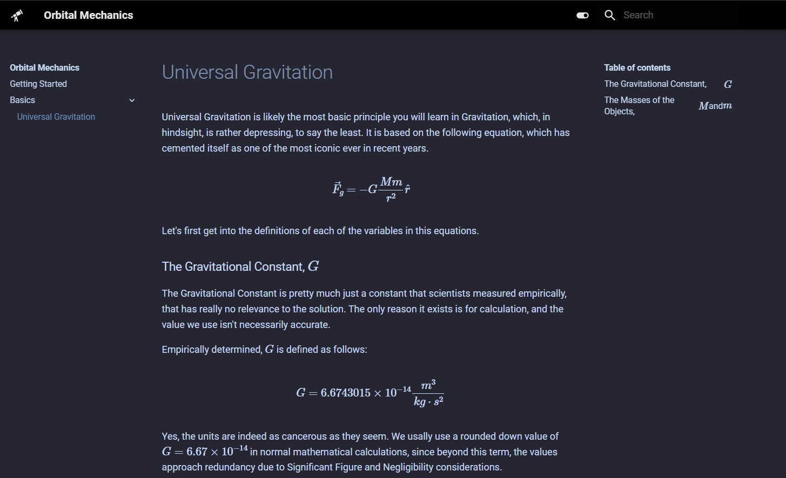

# Welcome to Astrosite!

Astrosite is a basic template to create Astronomy-related Websites in MkDocs with Material as a theme. This is a sample site template for the Astronomy Club CCA. You can use this for Theory and more stuff.

## Features
### LaTeX Support



The MkDocs system implemented provides comprehensive LaTeX support. By enclosing within a `$$ ... $$` for breakout highlighted LaTeX posts, or `$ ... $` for inline LateX, you can display mathematical text and information in a proper format.

For instance, `$x_a^b$` gives $x_a^b$, while `$e^{-x^2}$` will give $e^{-x^2}$, which is pretty helpful for highlighting variables or values between text.

On the other hand, we also have larger equations like the following:

```latex
$$\vec F_g = -G \frac{Mm}{r^2} \hat r$$
```

gives

$$\vec F_g = -G \frac{Mm}{r^2} \hat r$$

 Which is, of course, the vectorised equation of Universal Gravitation. Similarly, something like as follows:

 ```latex
$$\begin{align*} g &= G \frac{M}{r^2} \\ &= 9.806 - \frac{1}{2} (9.832 - 9.780) \times \cos \left( 2\theta \right) \end{align*}$$
 ```

It yields the following result, where $\theta$ denotes the angle of elevation.


$$\begin{align*} g &= G \frac{M}{r^2} \\ &= 9.806 - \frac{1}{2} (9.832 - 9.780) \times \cos \left( 2\theta \right) \end{align*}$$


This is useful especially in Physics-heavy fields of Astronomy, since they do require LaTeX for focusing on them.

Note that multiline statements still require it to be in one line since you are using markdown.